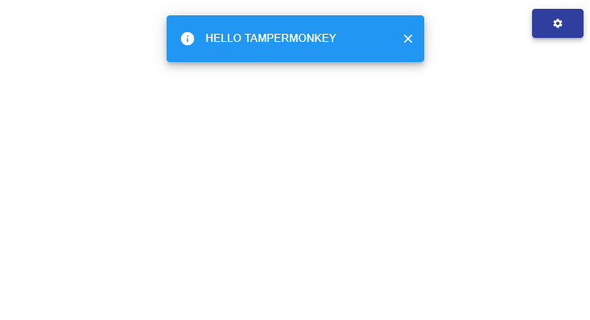
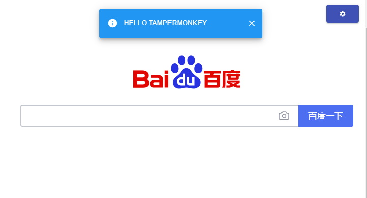

# <%= scaffoldConfig.projectName %>
模板来自 [quick-scaffold](https://github.com/xiaomingTang/quick-scaffold) -> [tampermonkey](https://github.com/xiaomingTang/quick-scaffold/template-tampermonkey/README.md)

<%= scaffoldConfig.description %>

------
development preview:


------
production preview:

### usage
```
$ yarn

# development
$ yarn start

# production (会自动复制到剪贴板, 需手动粘贴到油猴脚本输入框)
$ yarn build
```

### 项目特点
- 用于快速搭建油猴脚本
- `typescript` + `react` + `material-ui`(不用 `antd`, 因为 `antd` 会污染源网站的样式)
- `hot reload`(development环境下) +  `eslint` + `less` + `less module`
- 自动添加油猴脚本描述(详见[config/constants.ts](config/constants.ts))
- 油猴内置函数的类型支持(详见[config/constants.ts](config/constants.ts)和[https://github.com/silverwzw/Tampermonkey-Typescript-Declaration](https://github.com/silverwzw/Tampermonkey-Typescript-Declaration))

### 开发必读
- 需要根据自己需要, 自行配置[config/constants.ts](config/constants.ts)文件
